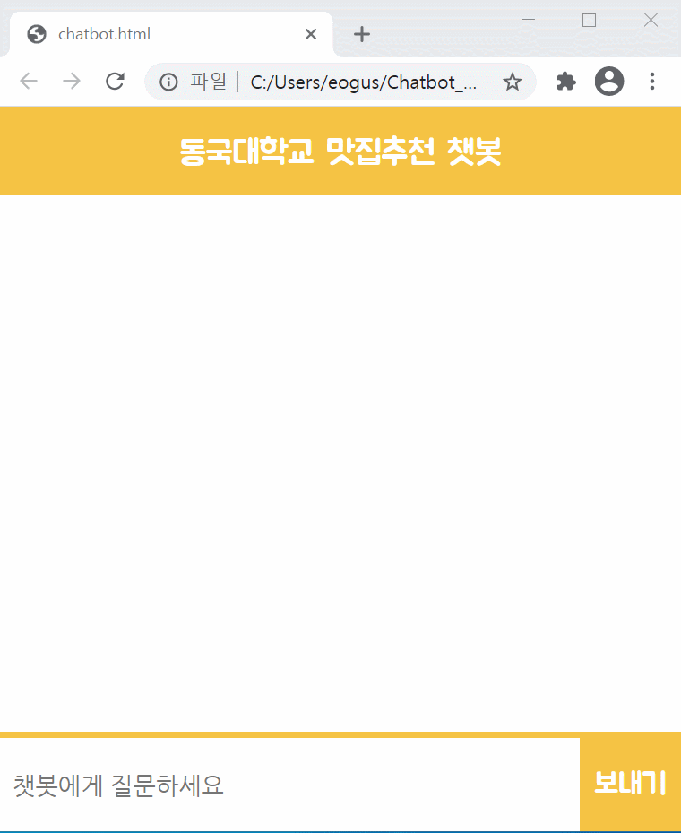

# Chatbot_Project
API를 사용하여 클라이언트와 서버가 데이터를 주고받을 수 있도록 하여 웹에서 동국대 주변 맛집 추천 딥러닝 챗봇 프로그램을 구현 

## Environment
frontend - React, Javascript, HTML, CSS

API - Flask (python)

chatbot - keras (python(tensorflow))

## How to run

### 1. chatbot 실행
```
$ conda activate chatbot  
$ python bot.py  
```
### 2. API 실행
```
$ cd ../../api  
$ flask run 
```
### 3. frontend 실행
```
React
$ yarn install     
$ yarn start
```
```
Javascript
chatbot.html 실행
```

## View Project
 
